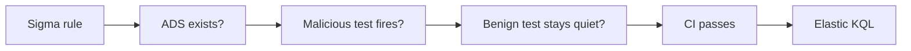

# Detection-as-Code

Security detection rules are software. They should be tested like software.

This project requires three things before a rule is considered ready:

1. a written Alerting and Detection Strategy (ADS)
2. malicious telemetry that **must** trigger
3. benign telemetry that **must not** trigger

It then converts the validated Sigma rule to Elastic KQL.



**Skills shown:** detection engineering, Python, CI/CD, Sigma, testing, technical documentation.

## Resume starter

> Built a CI-tested detection pipeline that blocks security rules from merging unless they catch malicious test events, ignore benign events, and include a written detection strategy.

Adapt that only after you run the project and can explain what you changed or tested yourself.


---

# Build it from zero

## What you will build

You are going to prove one idea:

**A security detection rule should be tested like software before it reaches production.**

By the end, you will:

- install Python
- download the project files
- create an isolated Python environment
- install the project dependencies
- run six automated tests
- see positive and benign detection gates
- convert a Sigma rule into Elastic KQL
- intentionally break a rule and watch the test suite catch it

You do not need Git.

---

# Part 1 — Install Python

## Step 1. Google Python

Search:

```text
Python download
```

Use the official site:

```text
https://www.python.org/downloads/
```

Install Python 3.10 or newer.

### Windows

Run the Python installer.

If the installer shows:

```text
Add python.exe to PATH
```

enable it.

Then open **PowerShell**.

Run:

```powershell
py --version
```

If `py` is unavailable, try:

```powershell
python --version
```

### macOS

Install the current Python 3 release from python.org.

Open **Terminal**.

Run:

```bash
python3 --version
```

**PASS:** Python reports version 3.10 or newer.

---

# Part 2 — Get the project files

## Beginner method — Download ZIP

Open:

```text
https://github.com/Emanuel-Walker/cyber-portfolio
```

Click:

```text
Code -> Download ZIP
```

Extract the ZIP.

Open:

```text
cyber-portfolio-main/01-detection-as-code
```

## Developer method — Git clone

Optional:

```bash
git clone https://github.com/Emanuel-Walker/cyber-portfolio.git
cd cyber-portfolio/01-detection-as-code
```

Git is not required.

---

# Part 3 — Open a terminal in the project folder

## Windows

Open the `01-detection-as-code` folder in File Explorer.

Click the address bar.

Type:

```text
powershell
```

Press Enter.

PowerShell should open directly in that folder.

Verify:

```powershell
Get-Location
```

## macOS

Open Terminal.

Type:

```bash
cd 
```

including the space after `cd`.

Drag the `01-detection-as-code` folder from Finder into Terminal.

Press Enter.

Verify:

```bash
pwd
```

**PASS:** the terminal path ends in `01-detection-as-code`.

---

# Part 4 — Create an isolated Python environment

This keeps this project's packages separate from the rest of your computer.

## Windows PowerShell

```powershell
py -m venv .venv
.\.venv\Scripts\Activate.ps1
```

If PowerShell blocks activation for this session:

```powershell
Set-ExecutionPolicy -Scope Process Bypass
.\.venv\Scripts\Activate.ps1
```

## macOS

```bash
python3 -m venv .venv
source .venv/bin/activate
```

**PASS:** your terminal prompt usually starts with:

```text
(.venv)
```

---

# Part 5 — Install the dependencies

Run:

```bash
python -m pip install --upgrade pip
python -m pip install -r code/requirements.txt
```

On macOS, if `python` is unavailable inside the virtual environment, use:

```bash
python3 -m pip install -r code/requirements.txt
```

**PASS:** installation finishes without an error.

---

# Part 6 — Understand what you are about to test

Open:

```text
code/rules/
```

You should see Sigma YAML detection rules.

Open:

```text
code/tests/
```

The test suite checks three things:

1. a malicious/attack-like event must fire the rule
2. a benign event must stay quiet
3. the written detection strategy must exist

That is the dual gate.

```text
bad behavior -> MUST MATCH
normal behavior -> MUST NOT MATCH
```

---

# Part 7 — Run the tests

Run:

```bash
pytest code/tests/ -v
```

Expected result:

```text
6 passed
```

You should see tests similar to:

```text
test_rule_fires_on_atomic[...] PASSED
test_rule_silent_on_benign[...] PASSED
test_ads_spec_present[...] PASSED
```

**PASS:** all six tests pass.

If a benign test fails, the rule is too broad.

If a malicious test fails, the rule is too weak or incorrect.

---

# Part 8 — Convert the Sigma rule

Run:

```bash
python code/converters/sigma_to_elastic.py code/rules/suspicious_powershell_download.yml
```

The script should print an Elastic KQL query.

Example shape:

```text
process.name:"powershell.exe" and process.command_line:(...)
```

**PASS:** a KQL query prints without an exception.

The project currently demonstrates automated conversion to **Elastic KQL**.

Do not describe Splunk or another backend as implemented unless a tested converter exists.

---

# Part 9 — Break the rule on purpose

This is the useful part.

Open:

```text
code/rules/suspicious_powershell_download.yml
```

Make one detection condition intentionally too broad.

For example, temporarily change a specific command-line condition so that normal PowerShell activity is more likely to match.

Save the file.

Run:

```bash
pytest code/tests/ -v
```

Expected:

At least one test should turn red.

That demonstrates why the benign gate exists.

Undo your temporary change.

Run the tests again.

**PASS:**

```text
6 passed
```

---

# Part 10 — What you just built

You now have this pipeline:

```text
Sigma rule
   |
   +--> written strategy exists?
   |
   +--> malicious event fires?
   |
   +--> benign event stays quiet?
   |
   v
tests pass
   |
   v
Elastic KQL artifact
```

That is Detection-as-Code.

---

# Common problems

## `python` is not recognized

Windows:

```powershell
py --version
```

macOS:

```bash
python3 --version
```

If neither works, reinstall Python from python.org.

## `pytest` is not found

Make sure the virtual environment is activated.

Then:

```bash
python -m pip install -r code/requirements.txt
python -m pytest code/tests/ -v
```

## PowerShell will not activate the virtual environment

For the current PowerShell window:

```powershell
Set-ExecutionPolicy -Scope Process Bypass
.\.venv\Scripts\Activate.ps1
```

## Tests collect zero items

Confirm the terminal path ends in:

```text
01-detection-as-code
```

Then run:

```bash
python -m pytest code/tests/ -v
```

---

# Definition of done

- [ ] Python installed
- [ ] project files downloaded
- [ ] virtual environment active
- [ ] dependencies installed
- [ ] six tests pass
- [ ] Elastic KQL conversion works
- [ ] you broke a rule and saw a test catch it
- [ ] you restored the rule and returned to green

You now understand the project well enough to explain it in an interview.

---

## What this project proves

This repository gives you an inspectable implementation, synthetic data, and a repeatable walkthrough.

It does **not** turn a lab result into a production guarantee. Read the limitations in the walkthrough and inspect the implementation before reusing it elsewhere.

## Key artifacts

Use the folders and source files directly. Supporting Markdown is kept only when it is itself part of the project, such as ADS documents, playbooks, detection matrices, or skill definitions.

<details>
<summary><strong>Engineering story / deeper notes</strong></summary>

It was a Friday push. The rule was eighteen lines of Sigma. It looked for `powershell.exe` with a command line containing `DownloadString` or `IEX`. Classic download cradle. I had tested it in my lab against an Atomic Red Team payload and it caught every variant. I merged it, kicked off the deploy, and went to dinner.

Saturday morning the on-call ping came in. 2,400 alerts overnight. By Sunday it was past 10,000. Every one of them was a legitimate configuration management agent pulling modules from an internal artifact server. The rule did exactly what I asked it to do. I just had not asked carefully enough.

That Monday the team lead did not yell. She said one thing: "I do not trust the detection pack anymore." That was worse than yelling. The whole value of a SOC detection is that an analyst picks up the ticket believing it means something. Burn that trust and every rule in the pack is now suspect. Nobody triages hard when they expect false positives.

## The problem

Detection engineering suffers from the same disease as early-career software engineering. We ship code without tests because the code is small and the author is confident. Then we go home. The code runs for 72 hours against production traffic we never saw in the lab, and we come back to a graveyard.

I needed a system where I could not ship a rule unless three things existed. One: a written spec explaining what the rule does, why it fires, what it misses, and when it will false-positive. Two: a positive test with telemetry that must trigger the rule. Three: a benign test with telemetry that must not. If any of those were missing, the pull request stays open.

## The build

The spec format is lifted straight from Palantir's Alerting and Detection Strategy framework. It is not a template to decorate the YAML. It is the design doc that forces you to think before you type. Here is the categorization block for my rebuilt PowerShell rule.

```markdown
## Categorization
- ATT&CK Technique: T1059.001 (PowerShell)
- ATT&CK Sub-Technique: T1105 (Ingress Tool Transfer)
- Kill Chain Phase: Delivery, Installation
```

Simple. But writing it meant I had to decide: is this a PowerShell abuse detection, or a download-cradle detection? The answer changes what field I key on. The first version keyed on `process.name == powershell.exe`. The rebuild keys on `process.command_line` patterns that are specific to in-memory download, with `powershell.exe` as a secondary filter. Different ATT&CK ID, different detection surface.

The CI side was a GitHub Actions workflow. The core idea is a pytest harness that walks the rules directory and refuses to pass if any rule is naked.

```python
def test_every_rule_has_spec_and_tests(rule_path):
    """
    This test is the gate. If it fails, the PR cannot merge.
    We check three things for every Sigma rule.
    First the ADS spec file exists next to it.
    Second a positive atomic test exists for the rule's ATT&CK ID.
    Third a benign fixture exists under the same ATT&CK ID.
    """
    ads_path = rule_path.with_suffix(".ads.md")
    assert ads_path.exists(), f"Missing ADS spec for {rule_path.name}"
```

The matching logic reads each event in the atomic YAML, applies the Sigma selection logic, and asserts a match. Then it runs the benign file and asserts no match. Both halves have to pass. If a rule catches the attacker telemetry but also lights up the backup agent, the build fails and tells you which event broke it.

The converter is a hundred lines of straight Python that walks a Sigma detection block and emits a KQL string suitable for Elastic. I did not use pySigma on purpose. I wanted to understand the mapping before I imported it. The converter is also exercised by the test suite, which means a bad field mapping gets caught before a backend ever sees the query.

## The gotcha

The honest ugly part. My first benign test was too clean. It was a fixture of `powershell.exe -NoProfile -Command Get-Service`. Of course the rule did not fire on that. The rule was never going to fire on that. I was patting myself on the back for passing a test that was not a test.

The second pass I grabbed real sanitized telemetry from the weekend blowup. The config agent did `powershell.exe -ExecutionPolicy Bypass -Command "(New-Object Net.WebClient).DownloadString('https://internal-artifacts/...')"`. That is the exact pattern my old rule caught. If my new rule still caught it, I had learned nothing.

I had to add a filter on the destination domain and a hash check on the parent process. Both are documented in the ADS Blind Spots section because now the rule misses a scenario where an attacker lives inside the internal artifact server. That is a real gap. The ADS writes it down instead of pretending it does not exist.

## Results

In lab testing the new rule catches eight out of nine Atomic Red Team variants of T1059.001 download cradles. The ninth uses a base64-encoded command and will be covered by a separate decoder rule I have not written yet. False positive rate on the sanitized production weekend is zero out of the 10,000 historical alerts. The one weakness is documented. The spec, the positive test, and the benign test all shipped in the same pull request.

More important than the numbers: nobody on the team has asked me "do I need to triage this one or is it probably noise" since the pipeline went live. The ticket shows up, they work it. That is the whole job.

## Three takeaways you can steal

**Write the spec first, write the rule second.** If you cannot explain in a paragraph why the rule fires, you cannot explain in a ticket why the analyst should care. The ADS is not paperwork. It is the design.

**Benign tests are harder than positive tests. Prioritize them.** A positive test proves your rule works on the thing you built it for. A benign test proves it does not work on the thing you did not. The second question is where production breaks you.

**Make the pipeline refuse the merge, not the human.** Code review catches typos. Code review does not catch "this rule will false-positive at 2 a.m. on Sunday." Only a test does. Put the test in CI and let it be the one that says no.

</details>


