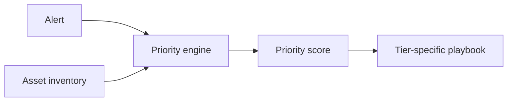

# Crown Jewel Triage

A SIEM severity label does not tell an analyst how much the threatened asset matters to the business.

This project adds asset context before prioritization.



The model scores four visible factors:

- business impact
- data sensitivity
- blast radius
- recovery cost

**Skills shown:** SOC strategy, risk prioritization, Python, playbooks, business context.

## Resume starter

> Designed an asset-centered alert prioritization model that ranks security events by business impact and routes them to tier-specific response playbooks.

Adapt it after you run the scorer and can explain the model.


---

# Build it from zero

## What you will learn

Most alert queues start with:

```text
How severe is the alert?
```

This project adds:

```text
What asset does the alert threaten?
```

By the end, you will:

- install Python
- download the project
- score a synthetic asset inventory
- prioritize six sample alerts
- generate a human-readable analyst queue
- inspect the four scoring factors
- change an asset's business impact
- watch alert priority change

You do not need Git.

You do not need a SIEM.

---

# Part 1 — Install Python

Google:

```text
Python download
```

Use:

```text
https://www.python.org/downloads/
```

Install Python 3.10 or newer.

## Windows

Open PowerShell:

```powershell
py --version
```

## macOS

Open Terminal:

```bash
python3 --version
```

**PASS:** Python 3.10+ prints.

---

# Part 2 — Get the project files

## Beginner method

Open:

```text
https://github.com/Emanuel-Walker/cyber-portfolio
```

Choose:

```text
Code -> Download ZIP
```

Extract it.

Open:

```text
cyber-portfolio-main/03-crown-jewel-triage
```

## Developer method

Optional:

```bash
git clone https://github.com/Emanuel-Walker/cyber-portfolio.git
cd cyber-portfolio/03-crown-jewel-triage
```

---

# Part 3 — Open a terminal in the project

## Windows

Open the project folder in File Explorer.

Click the address bar.

Type:

```text
powershell
```

Press Enter.

## macOS

Open Terminal.

Type:

```bash
cd 
```

Drag the project folder into Terminal.

Press Enter.

Verify:

```bash
pwd
```

or:

```powershell
Get-Location
```

**PASS:** the path ends in `03-crown-jewel-triage`.

---

# Part 4 — Create an isolated environment

## Windows

```powershell
py -m venv .venv
Set-ExecutionPolicy -Scope Process Bypass
.\.venv\Scripts\Activate.ps1
```

## macOS

```bash
python3 -m venv .venv
source .venv/bin/activate
```

Install PyYAML:

```bash
python -m pip install pyyaml
```

**PASS:** installation finishes without an error.

---

# Part 5 — Look at the asset inventory

Open:

```text
code/example_asset_inventory.yaml
```

Each asset has four scoring factors:

- business impact
- data sensitivity
- blast radius
- recovery cost

Those values determine the asset tier.

Open:

```text
code/models/scoring_rubric.yaml
```

That file explains how the scores map to tiers.

The model is intentionally visible.

A non-programmer should be able to inspect it.

---

# Part 6 — Look at the alerts

Open:

```text
code/example_alerts.jsonl
```

The file contains six synthetic alerts.

Look for examples involving:

```text
prod-payment-settlement-01
mkt-laptop-chen-l
```

The raw alert severity is not enough to determine business priority.

That is what you are about to prove.

---

# Part 7 — Score the alerts

Run:

```bash
python code/crown_jewel_scorer.py \
  --inventory code/example_asset_inventory.yaml \
  --alerts code/example_alerts.jsonl
```

Expected:

The script prints JSON results with a computed `priority_score`.

**PASS:** the payment-system alert receives a much stronger priority score than a lower-value endpoint even when the raw alert severity alone would not tell the whole story.

---

# Part 8 — Generate the analyst queue

Run:

```bash
python code/run_prioritization.py \
  --inventory code/example_asset_inventory.yaml \
  --alerts code/example_alerts.jsonl \
  --out queue.md
```

Open:

```text
queue.md
```

Or print it:

### macOS

```bash
cat queue.md
```

### Windows PowerShell

```powershell
Get-Content queue.md
```

**PASS:** the queue is ordered by computed priority and includes playbook guidance.

---

# Part 9 — Understand the model

The asset score is built from:

```text
business impact
+ data sensitivity
+ blast radius
+ recovery cost
```

Then the score maps to a tier.

Some asset types may route to a more appropriate response playbook.

That lets the project separate:

```text
How important is the asset?
```

from:

```text
What should the analyst do next?
```

---

# Part 10 — Change one factor

Now prove the model is understandable.

Open:

```text
code/example_asset_inventory.yaml
```

Pick one non-critical asset.

Increase its:

```text
business_impact
```

by one or two points.

Save the file.

Run the scorer again:

```bash
python code/crown_jewel_scorer.py \
  --inventory code/example_asset_inventory.yaml \
  --alerts code/example_alerts.jsonl
```

Then rebuild the queue:

```bash
python code/run_prioritization.py \
  --inventory code/example_asset_inventory.yaml \
  --alerts code/example_alerts.jsonl \
  --out queue.md
```

Compare the result.

**PASS:** the asset's priority changes in a way you can explain.

Undo your temporary change afterward.

---

# Part 11 — Read the playbooks

Open:

```text
playbooks/
```

The scorer answers:

```text
How important is this threatened asset?
```

The playbook answers:

```text
What should the analyst do?
```

That separation is intentional.

---

# Part 12 — What this model does not know

The sample inventory is synthetic.

A real organization would need owners to validate:

- business impact
- dependencies
- recovery requirements
- data sensitivity
- regulatory importance

The model is only as useful as the inventory behind it.

Do not call a score "objective" just because Python calculated it.

---

# Common problems

## `No module named yaml`

Run:

```bash
python -m pip install pyyaml
```

## The terminal cannot find the input files

Check your current location.

You should be inside:

```text
03-crown-jewel-triage
```

## You changed the inventory and the result looks strange

Open:

```text
code/models/scoring_rubric.yaml
```

Confirm the factor values stay inside the expected range.

---

# Definition of done

- [ ] Python installed
- [ ] PyYAML installed
- [ ] sample inventory inspected
- [ ] six alerts scored
- [ ] queue.md generated
- [ ] playbook links visible
- [ ] one asset factor changed
- [ ] priority changed in a way you can explain
- [ ] temporary change restored

You now understand the project beyond the screenshot.

---

## What this project proves

This repository gives you an inspectable implementation, synthetic data, and a repeatable walkthrough.

It does **not** turn a lab result into a production guarantee. Read the limitations in the walkthrough and inspect the implementation before reusing it elsewhere.

## Key artifacts

Use the folders and source files directly. Supporting Markdown is kept only when it is itself part of the project, such as ADS documents, playbooks, detection matrices, or skill definitions.

<details>
<summary><strong>Engineering story / deeper notes</strong></summary>

## The scene

A Tier 1 analyst I was mentoring pinged me at 2 a.m. during a shift. She had an alert open, a lateral movement signature on an internal host, and the SIEM called it Medium. She wrote:

> "I don't know if this is P2 or P3. The hostname looks weird. Do I escalate or finish my queue?"

I didn't have a good answer. Not a real one.

I asked what the host did. She didn't know. I asked who owned it. She didn't know. I asked if it talked to anything sensitive. She didn't know. Not because she was bad at her job. Because nobody had ever told her. The CMDB was three years stale. The asset tags in the SIEM were half-populated. The severity dropdown was the only thing she had, and she knew in her gut it was lying.

That is the problem this project is trying to fix.

## Why severity-based triage is broken

Severity is a label a detection engineer picked when they wrote the rule, usually six months ago, usually in a hurry, usually without knowing which hosts in your environment the rule would fire on. Severity does not know your business. It does not know that the host called `app-07` is actually the payment settlement service and the host called `prod-db-cluster-01` is actually a dev sandbox someone forgot to rename.

Three failure modes I see over and over:

**1. The buried P3.** A credential-stuffing attempt against the SSO admin console gets scored Medium because it is "just" a failed login burst. Nobody looks at it for six hours. Meanwhile the attacker has rotated IPs and is now 40,000 attempts in. By the time anyone catches it the attacker has moved on to password spray with better tradecraft and your detection has a one-shift head start.

**2. The screaming P1.** A new EDR deployment on a dev team's laptops fires 300 Highs about PowerShell encoded commands. All 300 are benign developer tooling. The queue fills up. The analyst who has been on shift for six hours stops reading them carefully. The 301st is real, from a different host, and gets closed as a dupe.

**3. The misclassified blast.** An alert on an endpoint fires Low because the alert is "non-interactive logon anomaly." The endpoint is a jump host used by the on-call DBA to reach every production database. The attacker is one `ssh` away from everything that matters. The analyst closes it in 90 seconds because the queue is deep and Low means Low.

Every one of those failures has the same root cause. The alert told the analyst how loud the detection felt. It did not tell the analyst what the attacker was reaching for.

## The reframe

The industry already has a name for this. Crown jewels. NIST uses it. CISA uses it. Mandiant and Gartner build threat models around it. The idea is simple. A small number of assets carry most of the risk. You do not defend every host equally. You identify what matters, you concentrate your watch there, and you accept risk on the rest.

Civilian SOCs know the term and almost never operationalize it. Call it a Key Asset model if "crown jewels" sounds too marketing. Either way, the idea is the same:

> Prioritize alerts by what the attacker is trying to reach, not by what the alert happens to say.

An alert on a Tier 1 asset gets human eyes in 15 minutes, no matter what the severity label says. An alert on a Tier 6 asset waits for the batch review, no matter how loud it is, unless it meets a specific escalation threshold.

That is the whole idea. The rest of this project is the plumbing to make it real.

## The 4-factor Key Asset score

Every asset in your inventory gets scored 1 to 5 on four factors. Total score maps to one of six tiers. The rubric is in `code/models/scoring_rubric.yaml`. Short version:

**Business impact.** If this asset is unavailable for 4 hours, does the business lose revenue, violate a contract, or hit the news? A payment processor is a 5. A dev sandbox is a 1. The question is not "is this important to IT." It is "is this important to the P&L."

**Data sensitivity.** What is the most sensitive data this asset touches, processes, or has credentials to reach? Regulated data (PCI, PHI, HIPAA-covered, financial records) is a 5. Public marketing content is a 1. Note the "has credentials to reach" clause. A build server with a cloud admin key is a 5 even if the server itself has nothing on it.

**Blast radius.** If this asset is fully compromised, how many other assets fall with it? A domain controller is a 5. A single contractor laptop with no persistent access is a 1. SSO is almost always a 5. CI/CD is almost always a 5. People underscore blast radius more than any other factor.

**Recovery cost.** If this asset is destroyed or ransomed, what is the real cost to restore to a known-good state? Includes rebuild time, data loss window, customer notification, legal exposure. A customer-data warehouse with weekly backups and no replica is a 5. An auto-scaling stateless container is a 1.

Add the four. Map to tier. Done.

- 18 to 20: Tier 1, Crown Jewels
- 15 to 17: Tier 2, High-Trust Identity (if the asset is an identity system) or Tier 3 (if it is build/deploy)
- 11 to 14: Tier 4, SaaS data paths
- 8 to 10: Tier 5, Lateral stepping stones
- 4 to 7: Tier 6, Noise

The tiers are not a strict linear ordering. Tier 2 and Tier 3 are different kinds of important and get different playbooks. Same for Tier 4 and Tier 5. See `playbooks/00-tier-definitions.md`.

## Playbook by tier, not by alert type

Here is the shift that makes this real. Stop writing playbooks per alert type. Start writing playbooks per tier.

A traditional SOC playbook library looks like this:

- `playbook_bruteforce.md`
- `playbook_powershell_encoded.md`
- `playbook_dns_tunneling.md`
- `playbook_impossible_travel.md`
- ... 200 more

Every one of those playbooks says some version of "investigate the alert, check the host, check the user, decide." They are generic because they have to be. They cannot know what the asset is worth.

A tier-based library looks like this:

- `tier1-crown-jewels.md`: ANY alert touches this, you page a human in 15 minutes. Pre-authorized to isolate the host without waiting for ticket approval. Communications tree is primed, legal is on the ping list, the CISO sees it in the morning stand-up no matter what.
- `tier5-lateral-stepping-stones.md`: Any auth or process anomaly gets a 1-hour SLA. Focus is on movement. First action is to pull session tokens and check for east-west traffic since the last known good login.
- `tier6-noise.md`: Batch review every 4 hours. Only escalate if the alert crosses a threshold (volume, novelty, or correlation with a higher-tier asset).

Each tier playbook in this repo includes assets covered, alerts covered, first 15 minutes, investigation steps, containment options, communication tree, and after-action requirements. They are shorter and more specific than per-alert playbooks because they can assume what the asset is worth.

## Rebuilding the dashboard

If you prioritize by tier, your dashboard has to measure by tier. The Grafana JSON in `dashboards/` has five panels, all grouped by tier:

- **MTTD by tier.** How long from alert fired to human eyes, split by tier. Tier 1 should be under 15 minutes 95% of the time. If it is not, that is a staffing problem, not a tool problem.
- **MTTR by tier.** From alert to closure. Tier 1 under 2 hours, Tier 6 under 24. These are starting numbers. Tune to your business.
- **Queue depth by tier.** Count of open alerts per tier. If Tier 1 queue is ever greater than zero for more than 15 minutes, something is wrong.
- **False positive rate by tier.** This is the panel that drives detection engineering. High FP on Tier 1 means a detection needs tuning now, because every FP burns the on-call. High FP on Tier 6 is tolerable because the batch absorbs it.
- **SLA conformance by tier.** Rolling 7-day percentage of alerts closed inside the tier SLA. This is what the CISO sees.

Nowhere on this dashboard is the word "severity." Severity is still in the data. It is just not the organizing principle anymore.

## Honest limitations

Four things this doesn't solve:

**1. It doesn't replace severity. It layers on top.** Severity is still a useful signal from the detection engineer about how confident they are in the detection. Tier is a signal about how much the business cares. You multiply them. You don't swap them.

**2. The asset inventory is the hard part.** If your CMDB is garbage, this gives you garbage. The code can read a YAML. It cannot tell you what your assets are. Expect the first pass of your Tier 1 list to take a week of conversations with the business, not a weekend of SQL.

**3. Tiering drifts.** An asset that was Tier 4 last quarter can become Tier 2 after a product launch. Reviewing the tier list quarterly is non-optional.

**4. Analysts have to buy in.** If you roll this out without walking the team through the reasoning, they will keep triaging by severity because that is what the UI shows them. The dashboard rebuild is as much culture work as it is engineering.

## Three takeaways

1. **Prioritize by what the attacker wants.** Severity tells you how loud the alert is. Tier tells you how much it matters that the alert is on this asset. The attacker is reaching for tier, not severity.

2. **Playbook by tier, not by alert type.** You will write fewer playbooks, they will be more specific, and your Tier 1 analysts will actually read them.

3. **Measure what you prioritize.** If your dashboard still groups by severity, your team will still think in severity. Rebuild the dashboard. The behavior follows.

The code in this repo is a prototype. The idea is not. Fortune 500 SOCs that have adopted a version of this quietly for years outperform their peers on MTTR for the alerts that actually matter. Open source it. Make it the default. Stop burying real attacks under alert labels an analyst picked in a hurry.

</details>


<details>
<summary><strong>Long-form thinking: why crown jewels matter</strong></summary>

Every SOC lead has watched this happen. A Tier 1 analyst closes 180 Mediums in a shift. The 181st was the one that mattered. By the time anybody notices, the attacker has been inside for 11 days and the only question left is how bad the blog post will be.

We blame the analyst. We blame the tooling. We buy a new SIEM. We rotate the on-call. We write a new runbook. Six months later it happens again. On a different team. With a different vendor. In a different industry.

It is not the analyst. It is not the tool. It is the organizing principle.

## The structural problem

Severity labels are assigned by the detection engineer who wrote the rule, usually before they knew which hosts in your environment the rule would fire on. "High" means the detection engineer felt confident the technique is malicious. It does not mean the alert is important.

Severity is a signal about the detection. Not a signal about the asset. Not a signal about the business. Not a signal about what the attacker is actually trying to reach.

When your queue is sorted by severity, you are telling your Tier 1 analyst: "work from the top." The top is whatever the detection engineer felt loud about. That is not a priority queue. That is a confidence queue dressed up as a priority queue.

The result is predictable:

- A Medium on your payment processor sits behind a High on a marketing contractor's laptop.
- An EDR deployment creates 300 benign Highs and the real one on host 301 gets closed as a dupe.
- An analyst who has triaged four hours of PowerShell encoded command alerts starts closing them in 45 seconds without reading the command.
- The P3 queue grows to 4,000 open alerts and becomes an archaeology project nobody is paid to run.

Burnout is the symptom. The queue is the disease.

## What good looks like

Walk into any mature SOC and find the senior analyst who has been there five years. Watch what they do when they pick up an alert. They do not look at the severity first. They look at the host. If the host is the SSO admin console, their eyes narrow and they pick up the phone. If the host is a dev sandbox, they shrug and keep triaging.

They are not reading severity. They are reading the asset.

That senior analyst has an informal tier list in their head. They know the top 20 systems in your company. They know which ones get credentials passed through them. They know which ones are one hop from the crown jewels. They are doing in their head what the queue should be doing in software.

The problem is that she is the only one doing it. She is on PTO this week. The analyst covering for her is on month three. He looks at the severity dropdown because that is what the UI shows him.

Good looks like making the senior analyst's instinct the default behavior of the queue.

## Three-step reframe anyone can start Monday

**1. Name your top 20.**

Pull your top 20 assets by business impact. Not by CMDB count. Not by compliance scope. By what the CFO would call if it went offline for 4 hours. Payment systems. Core customer data stores. SSO and identity providers. CI/CD. Source code. The DNS your customers resolve against. Write them down. 20, not 200. If you cannot fit it on an index card, you have not prioritized, you have inventoried.

Walk this list to your CISO. Ask one question: "If I had to pick 20 things to never let the attacker touch, is this the list?" Expect edits. That is the point.

**2. Tier your top 20 and build a Tier 1 playbook.**

Not a per-alert playbook. One playbook for "ANY alert on any Tier 1 asset." It says: human eyes in 15 minutes, pre-authorized to isolate, communications tree primed, CISO notified by stand-up. Three pages, not thirty.

Then do a Tier 1 fire drill. Pick a random Tier 1 asset. Have someone on your team pretend they just got an alert on it. Walk through the playbook. Time it. Find the gaps. Fix them. Do it again next week with a different asset.

Tier 1 is the one tier you have to get right. The rest you can iterate on.

**3. Rebuild one dashboard panel.**

One. Not the whole SIEM. Just one panel. Call it "MTTR by Asset Tier." Group alert resolution time by tier instead of by severity. Put it on the big screen in the SOC. Watch what happens.

Within a shift, analysts will start noticing which tier they are working. Within a week, they will start asking "what tier is this on?" before they ask "what severity is this?" Within a month, you will have a conversation with your detection engineering team that sounds different.

That conversation is the point.

## The challenge

Severity-based triage is the SOC equivalent of the airline that boards back-of-plane first because that is how it has always been done. It is not evil. It is not stupid. It is a default from an earlier era that nobody has had the time to replace.

You have the time. You just have not spent it yet.

Pick a day next week. Block two hours. Write your top 20. Walk them to your CISO. Pick one, write a one-page tier-based playbook for it, run a drill. Report back.

If you lead a SOC and your queue is still sorted by severity next quarter, your attacker is not the one who should be worried. Your analysts are.

</details>

