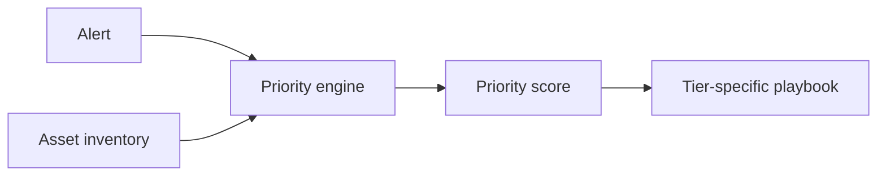

# Crown Jewel Triage

A SIEM severity label does not tell an analyst how much the threatened asset matters to the business.

This project adds asset context before prioritization.



The model scores four visible factors:

- business impact
- data sensitivity
- blast radius
- recovery cost

**Skills shown:** SOC strategy, risk prioritization, Python, playbooks, business context.

## Resume starter

> Designed an asset-centered alert prioritization model that ranks security events by business impact and routes them to tier-specific response playbooks.

Adapt it after you run the scorer and can explain the model.


---

# Build it from zero

## What you will learn

Most alert queues start with:

```text
How severe is the alert?
```

This project adds:

```text
What asset does the alert threaten?
```

By the end, you will:

- install Python
- download the project
- score a synthetic asset inventory
- prioritize six sample alerts
- generate a human-readable analyst queue
- inspect the four scoring factors
- change an asset's business impact
- watch alert priority change

You do not need Git.

You do not need a SIEM.

---

# Part 1 — Install Python

Google:

```text
Python download
```

Use:

```text
https://www.python.org/downloads/
```

Install Python 3.10 or newer.

## Windows

Open PowerShell:

```powershell
py --version
```

## macOS

Open Terminal:

```bash
python3 --version
```

**PASS:** Python 3.10+ prints.

---

# Part 2 — Get the project files

## Beginner method

Open:

```text
https://github.com/Emanuel-Walker/cyber-portfolio
```

Choose:

```text
Code -> Download ZIP
```

Extract it.

Open:

```text
cyber-portfolio-main/03-crown-jewel-triage
```

## Developer method

Optional:

```bash
git clone https://github.com/Emanuel-Walker/cyber-portfolio.git
cd cyber-portfolio/03-crown-jewel-triage
```

---

# Part 3 — Open a terminal in the project

## Windows

Open the project folder in File Explorer.

Click the address bar.

Type:

```text
powershell
```

Press Enter.

## macOS

Open Terminal.

Type:

```bash
cd 
```

Drag the project folder into Terminal.

Press Enter.

Verify:

```bash
pwd
```

or:

```powershell
Get-Location
```

**PASS:** the path ends in `03-crown-jewel-triage`.

---

# Part 4 — Create an isolated environment

## Windows

```powershell
py -m venv .venv
Set-ExecutionPolicy -Scope Process Bypass
.\.venv\Scripts\Activate.ps1
```

## macOS

```bash
python3 -m venv .venv
source .venv/bin/activate
```

Install PyYAML:

```bash
python -m pip install pyyaml
```

**PASS:** installation finishes without an error.

---

# Part 5 — Look at the asset inventory

Open:

```text
code/example_asset_inventory.yaml
```

Each asset has four scoring factors:

- business impact
- data sensitivity
- blast radius
- recovery cost

Those values determine the asset tier.

Open:

```text
code/models/scoring_rubric.yaml
```

That file explains how the scores map to tiers.

The model is intentionally visible.

A non-programmer should be able to inspect it.

---

# Part 6 — Look at the alerts

Open:

```text
code/example_alerts.jsonl
```

The file contains six synthetic alerts.

Look for examples involving:

```text
prod-payment-settlement-01
mkt-laptop-chen-l
```

The raw alert severity is not enough to determine business priority.

That is what you are about to prove.

---

# Part 7 — Score the alerts

Run:

```bash
python code/crown_jewel_scorer.py \
  --inventory code/example_asset_inventory.yaml \
  --alerts code/example_alerts.jsonl
```

Expected:

The script prints JSON results with a computed `priority_score`.

**PASS:** the payment-system alert receives a much stronger priority score than a lower-value endpoint even when the raw alert severity alone would not tell the whole story.

---

# Part 8 — Generate the analyst queue

Run:

```bash
python code/run_prioritization.py \
  --inventory code/example_asset_inventory.yaml \
  --alerts code/example_alerts.jsonl \
  --out queue.md
```

Open:

```text
queue.md
```

Or print it:

### macOS

```bash
cat queue.md
```

### Windows PowerShell

```powershell
Get-Content queue.md
```

**PASS:** the queue is ordered by computed priority and includes playbook guidance.

---

# Part 9 — Understand the model

The asset score is built from:

```text
business impact
+ data sensitivity
+ blast radius
+ recovery cost
```

Then the score maps to a tier.

Some asset types may route to a more appropriate response playbook.

That lets the project separate:

```text
How important is the asset?
```

from:

```text
What should the analyst do next?
```

---

# Part 10 — Change one factor

Now prove the model is understandable.

Open:

```text
code/example_asset_inventory.yaml
```

Pick one non-critical asset.

Increase its:

```text
business_impact
```

by one or two points.

Save the file.

Run the scorer again:

```bash
python code/crown_jewel_scorer.py \
  --inventory code/example_asset_inventory.yaml \
  --alerts code/example_alerts.jsonl
```

Then rebuild the queue:

```bash
python code/run_prioritization.py \
  --inventory code/example_asset_inventory.yaml \
  --alerts code/example_alerts.jsonl \
  --out queue.md
```

Compare the result.

**PASS:** the asset's priority changes in a way you can explain.

Undo your temporary change afterward.

---

# Part 11 — Read the playbooks

Open:

```text
playbooks/
```

The scorer answers:

```text
How important is this threatened asset?
```

The playbook answers:

```text
What should the analyst do?
```

That separation is intentional.

---

# Part 12 — What this model does not know

The sample inventory is synthetic.

A real organization would need owners to validate:

- business impact
- dependencies
- recovery requirements
- data sensitivity
- regulatory importance

The model is only as useful as the inventory behind it.

Do not call a score "objective" just because Python calculated it.

---

# Common problems

## `No module named yaml`

Run:

```bash
python -m pip install pyyaml
```

## The terminal cannot find the input files

Check your current location.

You should be inside:

```text
03-crown-jewel-triage
```

## You changed the inventory and the result looks strange

Open:

```text
code/models/scoring_rubric.yaml
```

Confirm the factor values stay inside the expected range.

---

# Definition of done

- [ ] Python installed
- [ ] PyYAML installed
- [ ] sample inventory inspected
- [ ] six alerts scored
- [ ] queue.md generated
- [ ] playbook links visible
- [ ] one asset factor changed
- [ ] priority changed in a way you can explain
- [ ] temporary change restored

You now understand the project beyond the screenshot.

---

## What this project proves

This repository gives you an inspectable implementation, synthetic data, and a repeatable walkthrough.

It does **not** turn a lab result into a production guarantee. Read the limitations in the walkthrough and inspect the implementation before reusing it elsewhere.

## Key artifacts

Use the folders and source files directly. Supporting Markdown is kept only when it is itself part of the project, such as ADS documents, playbooks, detection matrices, or skill definitions.
