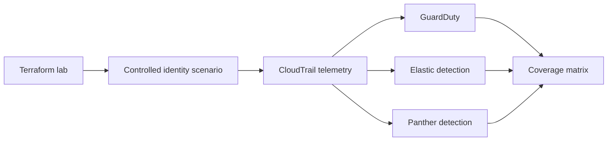

# Identity-First AWS Incident Response Lab

Cloud incidents often abuse valid identities, roles, and API calls instead of dropping obvious malware.

This project provides a free offline detection demo first, then an optional disposable AWS lab with Terraform, controlled identity scenarios, GuardDuty comparison testing, and custom Elastic/Panther detections.



**Skills shown:** AWS security, Terraform, IAM, CloudTrail, detection engineering, incident response.

## Resume starter

> Built a Terraform-deployed AWS security lab with identity-focused attack scenarios and custom detections that demonstrate where native cloud monitoring needs additional coverage.

Only claim the full cloud portion after you actually deploy and validate it.


---

# Build it from zero

## What you will learn

Cloud incidents often involve:

- stolen credentials
- over-privileged identities
- legitimate API calls used for the wrong purpose

This project gives you two paths.

### Path A — Offline demo

Free.

No AWS account required.

You will run one custom IAM detection against:
- a suspicious event that should match
- a benign event that should stay quiet

### Path B — Full AWS lab

Optional.

Creates real AWS resources and may create charges.

You will:
- create/secure an AWS account
- install AWS CLI
- install Terraform
- authenticate safely
- review the Terraform plan
- deploy a disposable lab
- generate controlled telemetry
- inspect detection coverage
- destroy the lab

Start with Path A.

---

# Path A — Offline detection demo

## Part 1 — Install Python

Google:

```text
Python download
```

Use:

```text
https://www.python.org/downloads/
```

Install Python 3.10 or newer.

### Windows

```powershell
py --version
```

### macOS

```bash
python3 --version
```

**PASS:** Python 3.10+ prints.

---

## Part 2 — Get the files

### Beginner method

Open:

```text
https://github.com/Emanuel-Walker/cyber-portfolio
```

Choose:

```text
Code -> Download ZIP
```

Extract it.

Open:

```text
cyber-portfolio-main/04-identity-cloud-ir
```

### Developer method

Optional:

```bash
git clone https://github.com/Emanuel-Walker/cyber-portfolio.git
cd cyber-portfolio/04-identity-cloud-ir
```

---

## Part 3 — Open a terminal in the project folder

### Windows

Open the folder in File Explorer.

Click the address bar.

Type:

```text
powershell
```

Press Enter.

### macOS

Open Terminal.

Type:

```bash
cd 
```

Drag the project folder into Terminal.

Press Enter.

**PASS:** your terminal is inside `04-identity-cloud-ir`.

---

## Part 4 — Run the suspicious event

Run:

### Windows

```powershell
py detections/demo_iam_detection.py attacks/demo_events/create_access_key.json
```

### macOS

```bash
python3 detections/demo_iam_detection.py attacks/demo_events/create_access_key.json
```

Expected:

```text
MATCH: IAM persistence / privilege-change detection
```

This synthetic event represents creation of an IAM access key.

---

## Part 5 — Run the benign event

### Windows

```powershell
py detections/demo_iam_detection.py attacks/demo_events/list_buckets.json
```

### macOS

```bash
python3 detections/demo_iam_detection.py attacks/demo_events/list_buckets.json
```

Expected:

```text
NO MATCH
```

**PASS:** one event fires and the benign event stays quiet.

---

## Part 6 — Inspect the real detection artifact

Open:

```text
detections/elastic_detection_rules/iam_access_key_creation.yml
```

The small Python demo mirrors the core IAM conditions for teaching purposes.

It is not a general Elastic query engine.

Also inspect:

```text
detections/panther_rules/
detections/detection_matrix.md
```

The matrix records measured lab coverage.

Do not turn `partial` into `catch` just because you want a prettier portfolio.

---

# Path B — Full AWS lab

Stop here if you only wanted to understand the project.

Everything below creates or prepares real cloud infrastructure.

---

# Part 7 — Create or choose a lab AWS account

If you do not have AWS:

Google:

```text
AWS create account
```

Use:

```text
https://aws.amazon.com/
```

Create the account.

## Immediately secure the root user

In the AWS console:

1. Open **IAM**.
2. Find the security recommendations.
3. Enable MFA for the root user.
4. Do not create root access keys.
5. Do not use the root user for normal lab CLI work.

## Create a budget

Search the AWS console for:

```text
Budgets
```

Create a monthly cost budget with email alerts.

Choose a low amount that makes sense for a temporary learning lab.

The goal is to know about spend before the bill surprises you.

---

# Part 8 — Set up non-root CLI access

Use a non-root identity.

For a new environment, prefer AWS's current temporary/SSO-style CLI authentication guidance such as IAM Identity Center rather than creating root credentials.

Google:

```text
AWS CLI IAM Identity Center configure SSO
```

Use AWS documentation under:

```text
docs.aws.amazon.com
```

After your identity is configured, you should have an AWS CLI profile or authenticated session.

Do not continue until you can prove which account the CLI will use.

---

# Part 9 — Install AWS CLI v2

Google:

```text
AWS CLI install
```

Use the official AWS documentation.

## Windows PowerShell

AWS currently provides a PowerShell installer:

```powershell
irm https://awscli.amazonaws.com/v2/install.ps1 | iex
```

Close and reopen PowerShell.

Verify:

```powershell
aws --version
```

## macOS

AWS currently provides an install script:

```bash
curl -fsSL https://awscli.amazonaws.com/v2/install.sh | bash
```

If your shell cannot find `aws`, close and reopen Terminal.

Verify:

```bash
aws --version
```

**PASS:** AWS CLI v2 prints.

---

# Part 10 — Authenticate the CLI

If you configured IAM Identity Center/SSO, follow the profile created by that setup.

Typical commands may include:

```bash
aws configure sso
aws sso login --profile [YOUR_PROFILE]
```

Then verify:

```bash
aws sts get-caller-identity --profile [YOUR_PROFILE]
```

If your authenticated profile is the default profile:

```bash
aws sts get-caller-identity
```

**STOP:** if the account ID is not the lab account you intend to use.

Write down:

```text
AWS account ID:
AWS CLI profile:
Region:
```

---

# Part 11 — Install Terraform

Google:

```text
Terraform install
```

Use:

```text
https://developer.hashicorp.com/terraform/install
```

## macOS with Homebrew

If you already use Homebrew:

```bash
brew tap hashicorp/tap
brew install hashicorp/tap/terraform
```

Verify:

```bash
terraform version
```

## Windows

Use HashiCorp's official Windows download instructions.

If you already use Chocolatey, HashiCorp documents:

```powershell
choco install terraform
```

HashiCorp does not maintain the Chocolatey package, so use the official binary download when you want the vendor-maintained release path.

Verify:

```powershell
terraform version
```

**PASS:** Terraform prints a version.

---

# Part 12 — Create the Terraform config file

From the project folder:

### Windows PowerShell

```powershell
Copy-Item terraform\terraform.tfvars.example terraform\terraform.tfvars
notepad terraform\terraform.tfvars
```

### macOS

```bash
cp terraform/terraform.tfvars.example terraform/terraform.tfvars
open -e terraform/terraform.tfvars
```

Read every variable.

Replace placeholders such as the email address and any lab-specific values.

If the file contains an allowed source CIDR:

Do not leave a world-open value for a real deployment.

Use only your authorized source range.

Never commit:

```text
terraform.tfvars
terraform state
AWS credentials
```

---

# Part 13 — Initialize Terraform

Run:

```bash
terraform -chdir=terraform init
```

Then:

```bash
terraform -chdir=terraform validate
```

**PASS:** validation succeeds.

---

# Part 14 — Review the plan

Run:

```bash
terraform -chdir=terraform plan
```

Do not scroll straight to the bottom and type yes later.

Read the resources.

Ask:

- What is being created?
- Is it in the right AWS account?
- Is it in the expected region?
- Are inbound rules limited?
- What will cost money?
- Do I know how to delete it?

If you cannot explain a resource, stop and inspect the Terraform file that creates it.

---

# Part 15 — Apply the lab

Only after the plan makes sense:

```bash
terraform -chdir=terraform apply
```

Terraform prints the plan again.

Review it.

Then approve.

**PASS:** Terraform completes without an error and prints outputs.

---

# Part 16 — Verify the AWS account again

Immediately after deployment:

```bash
aws sts get-caller-identity
```

Open the AWS console.

Confirm the lab resources exist where expected.

Do not run an attack scenario until you know what resources were created.

---

# Part 17 — Walk the attack scenarios

You do not need to open five more README files. The scenario guide is here.

Each scenario folder contains the runnable lab files. Use only the disposable lab resources created for this project.

## Scenario 01 — OAuth token theft

**Pattern:** leaked token or SaaS credential abuse.

**What happens:**
1. A fake OAuth refresh token is retrieved from SSM.
2. An access key is minted for the lab SaaS-style IAM user.
3. The stolen identity calls `iam:ListUsers` outside its intended scope.

**CloudTrail:** `ssm:GetParameter`, `iam:CreateAccessKey`, `iam:ListUsers`

**Detection:** Elastic `oauth_token_abuse.yml`, Panther `oauth_token_abuse.py`, Athena query 1.

Run:

```bash
cd attacks/01-oauth-token-theft
./run.sh
```

## Scenario 02 — NHI privilege escalation

**Pattern:** over-privileged non-human identity and role chaining.

**What happens:**
1. The lab assumes the over-privileged data-pipeline role.
2. It enumerates roles.
3. It retrieves the lab ExternalId from SSM.
4. It assumes the cross-account reader role.

**CloudTrail:** `sts:AssumeRole`, `ssm:GetParameter`, another `sts:AssumeRole`

**Detection:** Elastic `nhi_privesc_passrole.yml`, Panther `nhi_privesc_passrole.py`, Athena query 2.

Run:

```bash
cd attacks/02-nhi-privilege-escalation
./run.sh
```

## Scenario 03 — Cross-tenant session anomaly

**Pattern:** a valid session behaves unlike the identity's normal environment.

**What happens:** the lab assumes a role with an unusual user-agent and performs harmless enumeration.

**CloudTrail:** `sts:AssumeRole`, `iam:ListRoles`, `s3:ListBuckets`, `sts:GetCallerIdentity`

**Detection:** Elastic `cross_tenant_session_anomaly.yml`, Panther `cross_tenant_session_anomaly.py`, Athena query 3.

Run:

```bash
cd attacks/03-cross-tenant-session-anomaly
./run.sh
```

## Scenario 04 — SaaS-to-S3 exfiltration pattern

**Pattern:** valid credentials and valid API calls used to read an abnormal amount of data.

**What happens:** the lab role repeatedly reads the synthetic customer-data objects to create a measurable burst of `s3:GetObject` events.

**CloudTrail:** repeated `s3:GetObject`

**Detection:** Elastic `saas_exfil_api_pattern.yml`, Panther `saas_exfil_api_pattern.py`, Athena query 4.

Run:

```bash
cd attacks/04-saas-to-s3-exfiltration
./run.sh
```

## Scenario 05 — IAM persistence activity

**Pattern:** access-key creation and policy changes that can be used to maintain access.

**What happens:**
1. A lab IAM user is created.
2. An access key is created.
3. A read-only managed policy is attached as a safe stand-in for a dangerous privilege change.
4. The account password policy is queried.
5. The scenario cleans up its changes.

**CloudTrail:** `iam:CreateAccessKey`, `iam:AttachUserPolicy`, `iam:GetAccountPasswordPolicy`

**Detection:** Elastic `iam_access_key_creation.yml`, Panther `iam_access_key_creation.py`, Athena query 5.

Run:

```bash
cd attacks/05-guardduty-silent-iam
./run.sh
```

## What to record

For every scenario, capture:

- what identity performed the action
- which CloudTrail events appeared
- whether GuardDuty surfaced anything
- whether the custom rule matched
- what cleanup occurred

That comparison is the actual lab result.

---

# Part 18 — Review detection coverage

Open:

```text
detections/detection_matrix.md
```

Look for:

```text
catch
partial
miss
```

The lesson is not:

```text
GuardDuty is bad.
```

The lesson is:

```text
Native cloud security and environment-specific detections solve different parts of the problem.
```

---

# Part 19 — Destroy the lab

When the session is complete:

```bash
./terraform/teardown.sh
```

If you are on Windows and the shell script is not convenient, use Terraform directly:

```powershell
terraform -chdir=terraform destroy
```

Review the destroy plan.

Approve it.

Then open the AWS console.

Verify that billable lab resources are actually gone.

A successful terminal message is not your only cleanup check.

---

# Common problems

## `aws sts get-caller-identity` fails

Your CLI authentication is not ready.

Fix AWS CLI authentication before running Terraform.

## The wrong AWS account appears

**STOP.**

Do not run Terraform.

Switch to the correct profile/session.

## `terraform` is not recognized

Close and reopen the terminal after installation.

Confirm the Terraform binary is on PATH.

## Terraform asks for a value you do not understand

Do not guess.

Open:

```text
terraform/variables.tf
terraform/terraform.tfvars.example
```

Read the description before entering a value.

---

# Definition of done

## Offline mode
- [ ] suspicious IAM event matches
- [ ] benign event stays quiet
- [ ] detection artifacts inspected
- [ ] coverage matrix read

## Full lab
- [ ] root MFA enabled
- [ ] budget configured
- [ ] non-root CLI identity working
- [ ] `aws sts get-caller-identity` verified
- [ ] Terraform installed
- [ ] plan reviewed
- [ ] lab applied
- [ ] at least one controlled scenario understood
- [ ] detection matrix reviewed
- [ ] lab destroyed
- [ ] AWS console checked for leftovers

If you can explain every check above, you understand the project.

---

## What this project proves

This repository gives you an inspectable implementation, synthetic data, and a repeatable walkthrough.

It does **not** turn a lab result into a production guarantee. Read the limitations in the walkthrough and inspect the implementation before reusing it elsewhere.

## Key artifacts

Use the folders and source files directly. Supporting Markdown is kept only when it is itself part of the project, such as ADS documents, playbooks, detection matrices, or skill definitions.
