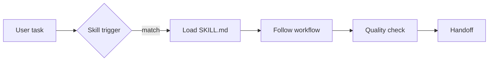

# AI Agent Skills

A skill is a small instruction package that teaches an AI agent one repeatable job.

Instead of rewriting one giant prompt every time, this project turns repeated work into scoped skills with triggers, boundaries, output contracts, and handoff checks.



The library includes skills for writing, documentation, UI review, repo onboarding, prompt optimization, Obsidian workflows, file organization, diagrams, OCR, and companion context.

**Skills shown:** agent design, prompt architecture, technical writing, workflow automation, tool governance.

## Resume starter

> Built a reusable library of agent skills that turns repeated work into scoped, testable instruction modules with clear triggers, boundaries, and output contracts.

Adapt it after you install, test, or build your own skill.

---

# Build it from zero

## What you will learn

A skill is a folder that teaches an AI agent how to perform one repeatable job.

The important file is:

```text
SKILL.md
```

A good skill tells the agent:

- what the skill does
- when to use it
- when not to use it
- what steps to follow
- what a good result looks like
- what to check before handoff

By the end, you will:

- install Codex or Claude Code
- download the skill library
- run the Humanizer skill explicitly
- optionally install a skill into your agent setup
- install a starter pack
- create your own tiny skill
- test whether the skill actually changes agent behavior

You do not need Git.

---

# Part 1 — Choose one coding agent

Pick one.

## Option A — Codex

Use this if you already use ChatGPT/OpenAI.

## Option B — Claude Code

Use this if you already use Claude/Anthropic.

Do not install both just to complete this walkthrough.

---

# Part 2A — Install Codex

## Step 1A. Create or confirm your ChatGPT account

Open:

```text
https://chatgpt.com
```

Sign in.

## Step 2A. Install Node.js

Google:

```text
Node.js LTS
```

Use:

```text
https://nodejs.org/
```

Install the current LTS release.

Close and reopen your terminal.

Check:

### Windows PowerShell

```powershell
node --version
npm --version
```

### macOS Terminal

```bash
node --version
npm --version
```

## Step 3A. Install Codex

```bash
npm install -g @openai/codex@latest
codex --version
```

On Windows, if PowerShell blocks `npm`, try:

```powershell
npm.cmd install -g @openai/codex@latest
codex --version
```

**PASS:** Codex prints a version.

---

# Part 2B — Install Claude Code

Claude Code's recommended path is the native installer.

You do not need Node.js for the recommended native installation.

## macOS

Open Terminal.

Run:

```bash
curl -fsSL https://claude.ai/install.sh | bash
```

Then verify:

```bash
claude --version
claude doctor
```

## Windows PowerShell

Open PowerShell.

Run:

```powershell
irm https://claude.ai/install.ps1 | iex
```

Open a new PowerShell window.

Verify:

```powershell
claude --version
claude doctor
```

You do not need Administrator privileges for the normal native install.

### Windows alternative

If you already use WinGet:

```powershell
winget install Anthropic.ClaudeCode
claude --version
```

Git for Windows is optional.

WSL 2 is optional if you specifically want a Linux toolchain or sandboxing.

**PASS:** Claude Code prints a version and `claude doctor` reports no blocking install problem.

# Part 3 — Get the skill library

## Beginner method

Open:

```text
https://github.com/Emanuel-Walker/cyber-portfolio
```

Choose:

```text
Code -> Download ZIP
```

Extract it.

Open:

```text
cyber-portfolio-main/05-ai-agent-skills
```

## Developer method

Optional:

```bash
git clone https://github.com/Emanuel-Walker/cyber-portfolio.git
cd cyber-portfolio/05-ai-agent-skills
```

---

# Part 4 — Open a terminal in the skill project

## Windows

Open the `05-ai-agent-skills` folder.

Click the File Explorer address bar.

Type:

```text
powershell
```

Press Enter.

## macOS

Open Terminal.

Type:

```bash
cd 
```

Drag the folder into Terminal.

Press Enter.

**PASS:** the terminal is inside `05-ai-agent-skills`.

---

# Part 5 — Inspect one skill before using it

Open:

```text
skills/humanizer/SKILL.md
```

Look at the front matter.

You should see fields similar to:

```yaml
---
name: humanizer
description: ...
---
```

Then read the instructions.

This is important.

Do not install random public skills without reading them first.

Skills can contain:
- instructions
- scripts
- references
- templates
- assets

Treat them like code.

---

# Part 6 — Run the skill explicitly

This is the most reliable first test.

Launch your agent from the `05-ai-agent-skills` folder.

## Codex

```bash
codex
```

## Claude Code

```bash
claude
```

Then paste:

```text
Read:

skills/humanizer/SKILL.md

Use that skill strictly on this paragraph:

"In today's rapidly evolving threat landscape, organizations must leverage robust, scalable solutions to seamlessly integrate advanced detection capabilities. Moreover, by utilizing cutting-edge AI, security teams can delve into unprecedented insights that empower proactive defense."

Return:
1. the rewritten paragraph
2. five specific skill rules you applied
```

Expected behavior:

The rewrite should remove or reduce words such as:

```text
leverage
robust
seamlessly
utilizing
delve
moreover
```

It should also become shorter and more direct.

**PASS:** the output clearly reflects rules from the skill file.

This proves the skill itself works before you worry about automatic discovery.

---

# Part 7 — Install one skill

This repo includes helper scripts.

## macOS / Linux

For Codex:

```bash
bash scripts/install-skill.sh codex humanizer
```

For Claude Code:

```bash
bash scripts/install-skill.sh claude humanizer
```

## Windows PowerShell

Codex:

```powershell
.\scripts\install-skill.ps1 -Agent codex -Item humanizer
```

Claude:

```powershell
.\scripts\install-skill.ps1 -Agent claude -Item humanizer
```

The installer refuses to silently overwrite an existing skill folder.

**PASS:** it prints:

```text
PASS: install complete.
```

---

# Part 8 — Verify the installed files

## Codex example

Check:

```text
~/.codex/skills/humanizer/SKILL.md
```

## Claude example

Check:

```text
~/.claude/skills/humanizer/SKILL.md
```

On Windows, `~` means your user home directory.

If your current agent version uses a different skills/plugin mechanism, the explicit-read workflow from Part 6 still works.

Do not confuse:

```text
the skill file is valid
```

with:

```text
my exact agent build auto-discovers this folder
```

Those are separate questions.

---

# Part 9 — Install a starter pack

The project includes three packs.

## Builder pack

```text
repo-onboarding-audit
builder-walkthrough
web-ui-audit
prompt-optimizer
```

Install:

```bash
bash scripts/install-skill.sh codex builder-pack
```

or:

```powershell
.\scripts\install-skill.ps1 -Agent codex -Item builder-pack
```

## Writing pack

Includes writing/humanization skills.

## Second Brain pack

Includes:
- Obsidian workflow skill
- companion-context skill
- file organizer
- docs readability audit

Do not install every skill just because it exists.

Install what you will actually use.

---

# Part 10 — Build your first skill

Create:

```text
skills/my-first-skill/
```

Inside it create:

```text
SKILL.md
```

Paste:

```markdown
---
name: next-action
description: Use when the user has too many tasks and needs one concrete next action.
---

# Next Action

Use this skill when the user gives you a messy task list or says they are stuck.

1. Identify the single outcome that matters most.
2. Choose one action that can be completed in 20 minutes or less.
3. Return only:
   - Next action
   - Why this one
   - Definition of done

Do not create a full productivity system.

Before handoff, confirm the action is concrete and physically doable.
```

Save it.

---

# Part 11 — Test your new skill

In Codex or Claude Code:

```text
Read:

skills/my-first-skill/SKILL.md

Use it on this list:

- clean up my portfolio
- study AWS
- reply to emails
- reorganize all my notes
- update one broken project walkthrough
```

Expected shape:

```text
Next action:
...

Why this one:
...

Definition of done:
...
```

**PASS:** the agent chooses one action instead of giving you another giant list.

---

# Part 12 — Improve the skill

Ask:

```text
Audit skills/my-first-skill/SKILL.md.

Tell me:
1. when the trigger is too vague
2. where the instructions could conflict
3. one test case that should invoke it
4. one test case that should NOT invoke it

Do not edit the file yet.
```

That is skill engineering.

The hard part is not writing Markdown.

The hard part is making the instructions:
- narrow
- discoverable
- testable
- safe
- reusable

---

# Common problems

## Agent ignores the skill

Use the explicit form:

```text
Read path/to/SKILL.md and use it strictly.
```

Then diagnose discovery separately.

## Installer says the folder already exists

That is intentional.

Read the existing installed skill first.

Remove or update it deliberately.

## Skill triggers too often

Tighten the `description` front matter.

The description should explain:
- what the skill does
- when it should be considered

## Skill produces inconsistent output

Add an output contract.

Example:

```text
Return exactly:
1. Finding
2. Evidence
3. Fix
```

---

# Definition of done

- [ ] Codex or Claude Code installed
- [ ] skill library downloaded
- [ ] Humanizer skill inspected
- [ ] Humanizer explicitly tested
- [ ] one skill installed
- [ ] starter pack understood
- [ ] your own SKILL.md created
- [ ] custom skill tested
- [ ] trigger/boundary audit completed

You now understand the skill system well enough to build your own reusable agent workflows.

---

## What this project proves

A reusable agent workflow can be treated like an engineering artifact with a clear trigger, narrow scope, expected output, and handoff checks.

A skill does not make an AI model automatically correct. Human review still matters.

## Key artifacts

- `skills/<name>/SKILL.md` = the actual reusable skill
- `scripts/` = optional installers
- `THIRD_PARTY_ATTRIBUTION.md` = upstream inspiration and licensing notes

<details>
<summary><strong>Engineering story / deeper notes</strong></summary>

## What a "skill" is in this sense

A skill is a single instruction module that an AI assistant can load on demand. In Claude Code it lives at `~/.claude/skills/<name>/SKILL.md`. It has YAML front matter with a `name` and `description` field. The description is the trigger. When your prompt matches the description, the assistant reads the body of the file and applies the rules inside.

That is it. No code. No runtime. No plugin install. The whole mechanism is the assistant deciding "this instruction block is relevant to the current request" and reading the file.

Cursor does something similar through its rules file, though less dynamically. Any skill-aware assistant can be adapted to the pattern. The point is modular, loadable instructions instead of one giant system prompt that tries to cover everything.

## Why modular beats monolithic

I started where most people start. One system prompt. One file called `instructions.md` that tried to cover every situation I cared about. Voice rules, folder paths, canonical quote handling, what to never fabricate, how to format a long-form draft, how to open a file in Obsidian from PowerShell. All of it in one place.

The problem showed up fast. The system prompt got long. The assistant lost focus. Rules that mattered for one task would bleed into tasks where they did not apply. Humanizer rules written for personal essays would quietly strip em dashes out of an academic paper where em dashes were fine. Content-engine rules written for short-form video would show up when I was drafting a technical post. The signal-to-noise ratio collapsed.

Modular instructions fix that. The humanizer skill loads only when I ask for humanizer work. The content-engine skill loads only when I touch content. The obsidian skill loads only when I touch the vault. When I draft a paper, three skills chain in order (brand-voice, article-writing, humanizer) and each one does its narrow job. No cross-contamination.

There is a second benefit. Each skill is readable on its own. I can open the humanizer file and know exactly what it does. If I want to change how I handle rule-of-three, I change one file. If I want to retire a skill, I delete one folder. Nothing is tangled.

## Three patterns I used across these ten

### 1. Trigger clarity

Every skill opens with a `description` field that reads like a trigger. "Remove AI-writing tells from text." "Build a durable VOICE PROFILE from real source material." "Create and edit draw.io diagrams in XML format." The description tells the assistant what the skill is for. If the description is vague, the assistant loads the wrong skill or loads nothing. If the description is sharp, routing is clean.

I also encoded "when to use" and "when NOT to use" sections inside each skill body. The negative cases matter as much as the positive ones. The prompt-optimizer skill explicitly says "if the user says 'just do it', do not run this skill. Execute instead." Without that, the skill would catch requests it should ignore.

### 2. Scope boundary

Each skill declares what it owns and what it does not own. The content-engine skill writes exclusively to `<your-content-root>/`. The obsidian skill handles general vault ops but defers to specialized vault-local skills for things like dream interpretation or extracting signals from daily notes. The smart-ocr skill never overwrites source files. It writes to a sidecar.

Scope boundaries prevent collisions. Two skills with overlapping scope will fight. Two skills with clean boundaries will chain. The write-zone rule in content-engine is the sharpest version of this pattern. Everything outside that folder is read-only to the skill. The assistant cannot accidentally rewrite a reference file.

### 3. Output contract

Each skill specifies what its output looks like. Humanizer delivers a draft, a bullet list of remaining tells, a final rewrite, and an optional changelog. Prompt-optimizer delivers five numbered sections in a specific order. Ship-learn-next delivers a saved markdown file with a defined frontmatter block and a Rep 1 block highlighted in chat.

Output contracts matter because downstream skills depend on them. The content-engine skill saves a draft with `status: needs-review` in frontmatter. The humanizer skill knows that `needs-review` means "touch this." If one skill broke the contract, every downstream skill would break too. Making the contract explicit in the skill file keeps the chain intact.

## Honest limits

These are personal. The humanizer skill reflects my own preferences. No em dashes in operational voice. No AI vocabulary I happen to notice. Rule-of-three when I think it is padding. Someone else's humanizer would ban different words, treat em dashes differently, let different cliches through.

The folder paths are placeholders. Everywhere a path appears, I replaced my own path with `<your-vault-root>` or `<your-content-root>` or `<your-system-folder>`. If you fork and keep the placeholders, nothing runs. You have to decide what your folder structure looks like and fill them in.

The platform assumptions are mine. Content-engine assumes short-form vertical video and long-form social. If you ship a podcast or a newsletter or a GitHub project, the format spec needs rewriting. Smart-ocr assumes PaddleOCR 3.6 on Windows. On Linux the oneDNN workaround is unnecessary. On a Mac the install path differs.

None of that is a problem if you treat these as reference. The logic generalizes. The specifics do not.

## What a reader can steal

If you are building your own skill set, the patterns transfer.

- Write a trigger description that says exactly what the skill does and what it does not do. Vague descriptions lose routing precision.
- Draw a scope boundary around what the skill writes to. Anything outside that boundary should be read-only.
- Specify the output shape. Downstream chains need a contract.
- Encode negative examples. "When NOT to use this skill" is as useful as "when to use."
- Keep each skill short enough to re-read in one sitting. If it does not fit in a scroll or two, split it.
- Reference other skills by name instead of inlining their rules. Cross-skill chains are the point.

The ten here are a starting set. Mine. If any one of them clicks for your workflow, keep that one, discard the rest, and build your own with the same pattern.

That is how I think about these. A tool is only as sharp as the instructions behind it, and modular instructions stay sharp longer than monolithic ones. Fork what works. Replace what does not.

</details>
